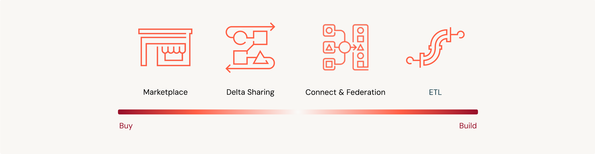
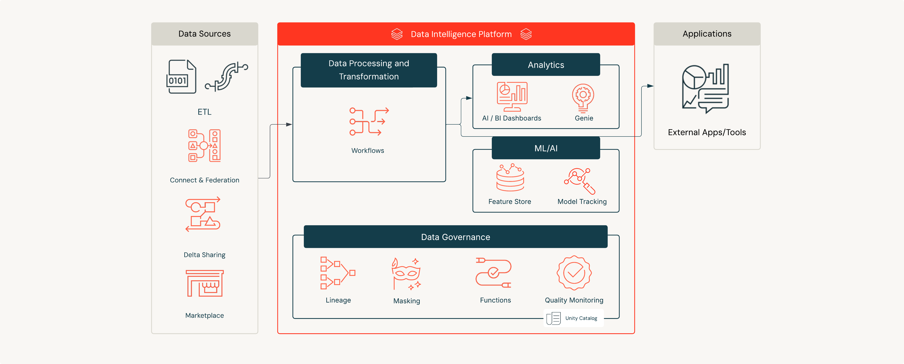
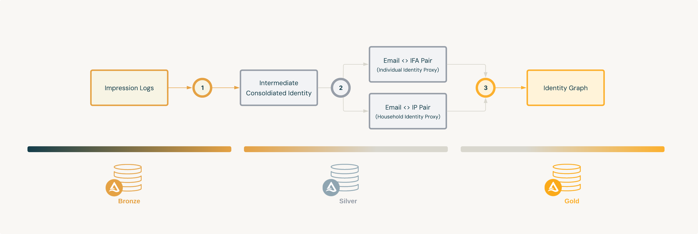

# Building a Digital Identity Graph for Ad Tech

## Overview

This demo walks through the construction of a simple digital identity graph using advertising impression logs on Databricks. It is designed to help you understand the foundational concepts and implementation steps behind building an identity graph in a modern data and AI platform.

---

## What is an Identity Graph?

In advertising, an **Identity Graph** is typically a table or product that links multiple identity spaces together—usually at the household or individual level. These identity spaces may include:

- Email Addresses
- IP Addresses
- Identifiers for Advertising (IFAs)
- First-party (1P) identifiers

Depending on business needs, identity graphs may also incorporate traditional or **terrestrial identity spaces**—such as hashed names, physical addresses, or phone numbers. Though these are not covered in this demo, they can easily be incorporated into the workflow.

### What Does An Identity Graph Look Like?

A typical row in an identity graph might look like:

| household_id  | individual_id | hashed_email | primary_ifa        | primary_ip_address |
| --------------|---------------|--------------|--------------------|--------------------|
| HH001         | 123abc        | ab3...xyz    | gaid:7899-sfd-sfdf | 1.2.3.4            |

It may also include:
* Timestamps of last seen (e.g. from Ad Server, or Surveys/Census Data)
* Weights or confidence scores
* Multiple secondary identifiers per email or device

In this solution accelerator, we will be including timestamp and secondary identifiers to enrich our graph.

---

## What It's Used For

An identity graph is essential for advertisers who need to use anonymized audience identities at the individual or household level—based on what they know about those identities. Defining a segment by household or person is conceptually simpler and more useful for marketers, but platforms often require targeting to happen in more granular or fragmented identity spaces. This is where an identity graph comes in.

It acts as a bridge between a **unified identity** (like a household or individual) and the various identity spaces used across digital platforms (e.g., IFAs, IP addresses, emails). A well-built identity graph provides this bi-directional mapping, unlocking key capabilities:

- **Consistent Audience Targeting**  – Accurately translate your known customer segment into the identity format required by each platform (e.g., streaming services, mobile apps, or web environments).

- **Cross-Platform Measurement & Deduplication** – Accurately tie impressions and conversions across different devices and platforms back to the same person or household. This helps you understand true reach, de-duplicate counts, and avoid overstating your audience size.

- **More Meaningful Attribution Studies** – Link digital ad exposures to real-world outcomes—like purchases—at the individual or household level, supporting privacy-conscious yet effective measurement and analysis.

- **Frequency Capping** – Prevent overexposing the same person to ads across devices and platforms for a better customer experience and improved campaign efficiency.

In short, a performant identity graph is foundational for modern, privacy-conscious, and effective digital advertising. Getting it right is critical.

---

## Common Challenges

Building and maintaining an identity graph is not without its complexities. Below are some of the most common challenges:

### ✅ Privacy and Consent Management

Respecting user privacy and adhering to data regulations (like GDPR, CCPA, COPPA etc.) is foundational. Identity graphs must be designed to honor user opt-outs, manage consent signals, and avoid storing or activating data that violates user preferences.

### 🔁 Identity Refresh and Decay

Identities change over time—people switch devices, clear cookies, or stop using certain email addresses. A performant identity graph must be able to refresh and re-evaluate links regularly to avoid using stale or misleading identity connections.

### 🔎 Data Quality

Most digital identity data is noisy. A good identity graph pipeline must account for:

- **Normalization**: Cleaning identifiers for consistency (e.g., stripping email addresses of tags like `+promo`, correcting common typos, or standardizing IP address formats).
- **Filtering**: Removing invalid records (such as fake or malformed email addresses, null values, or low-confidence identifiers).
- **Contextual Understanding**: Recognizing when certain identity signals might be shared or misleading (for example, hotel Wi-Fi IPs used by many users, or public/shared devices), and adjusting confidence levels accordingly.

Without careful data curation, identity graphs can create false connections—or worse, miss real ones.

---

## Making an Identity Graph in Databricks

</img>

Whether you're looking to build your own identity graph or buy a solution from a vendor or partner, Databricks can support you across the full spectrum.

If you're leaning toward the **buy** side, Databricks makes it easy to connect to pre-built identity graphs and enrichment datasets via [Databricks Marketplace](https://marketplace.databricks.com/?category=Advertising%20and%20marketing&sortBy=popularity) or partner integrations. In just a few clicks, you can hydrate your graph with high-quality data or leverage third-party solutions for identity resolution and enrichment.

This accelerator leans toward the **build** side of the spectrum—it walks through how to construct a graph using impression log data and first-party identifiers. However, it's deliberately designed to be **modular and extensible**: you can easily enhance this example using additional identity signals, enrichment data, or **proprietary matching logic** specific to your use case. Within this accelerator we make notes on where and what can be added to make this solution your own.

Some foundational Databricks features within this Accelerator that simplify the process and help reduce operational overhead are:

- **Workflows** for operationalizing and automating the construction and refresh cycles of your identity graph.

- **AI/BI Dashboards** for analytics and monitoring—offering immediate insights and supporting business applications downstream.

- **Unity Catalog** for governing and tracking data automatically (leveraging built-in lineage).

The diagram below shows how these tools fit together within the Databricks Platform and additional Databricks features you can leverage to accelerate your identity graph initiatives.

</img>

Regardless of approach, the flexibility of the Databricks Platform helps you operationalize your identity strategy while staying in control of your data and infrastructure.

---

## Solution Architecture

This accelerator demonstrates how to build a simple—but fully extensible—digital identity graph on Databricks using Workflows, Unity Catalog, and an AI/BI Dashboard. You'll start with *advertising impression logs* and progress through a [**Medallion Architecture**](https://www.databricks.com/glossary/medallion-architecture) pipeline (Bronze → Silver → Gold), resulting in a clean, query-ready *identity graph*. 

The example is deliberately lightweight to be approachable for new users, yet modular enough for advanced teams to extend with custom logic, enrichment data, or machine learning models.

</img>

The Workflow orchestrates the following steps:

| Step | Table                       | Layer   | Purpose                                        |
|------|-----------------------------|---------|------------------------------------------------|
| 0    | Impression Logs              | Bronze  | Raw campaign impression activity with device-level identifiers and metadata. |
| 1    | Intermediate Consolidated Identity Table  | Silver  | Optimized for operational efficiency; aggregates identifiers for multiple use cases.|
| 2    | Individual-Level Proxy Table | Silver  |Stores identity resolution results at the individual level (not queried directly).|
| 2    | Household-Level Proxy Table|Silver  |Stores resolved household identifiers.|
| 3    | Final Identity Graph | Gold |Combines individual and household proxies into a unified, query-ready graph.|

</img>

This layered approach makes it easier to debug, maintain, and evolve as your matching logic becomes more sophisticated.

---

## Installation Guidelines

### 1. Clone the Project

Clone this project into your Databricks Workspace:

### 2. Open the Asset Bundle Editor

Open the Asset Bundle Editor in the Databricks UI:

### 3. Deploy

Click on "Deploy":

### 4. Run the Job

Navigate to the Deployments tab in the Asset Bundle UI (🚀 icon) and click "Run" on the job available. This will run the notebooks from this project sequentially.

---

## Data Generation

The synthetic data used in this solution accelerator was generated using:
- [**dbldatagen**](https://github.com/databrickslabs/dbldatagen) - Databricks Labs Data Generator for creating large-scale synthetic datasets
- [**Faker**](https://github.com/joke2k/faker) - Python library for generating realistic fake data

These tools were used during development to create sample impression logs and identity data for demonstration purposes.

---

## Contributing

1. **git clone** this project locally
2. Utilize the Databricks CLI to test your changes against a Databricks workspace of your choice
3. Contribute to repositories with pull requests (PRs), ensuring that you always have a second-party review from a capable teammate

---

## 📄 Third-Party Package Licenses

&copy; 2025 Databricks, Inc. All rights reserved. The source in this project is provided subject to the Databricks License [https://databricks.com/db-license-source]. All included or referenced third party libraries are subject to the licenses set forth below.

| Package | License | Copyright |
|---------|---------|-----------|
| databricks-sdk | Apache-2.0 | Databricks, Inc. |
| dbldatagen (data generation) | Apache-2.0 | Databricks Labs |
| Faker (data generation) | MIT | Daniele Faraglia and contributors |

